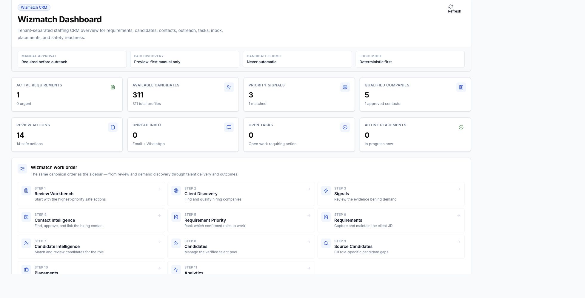
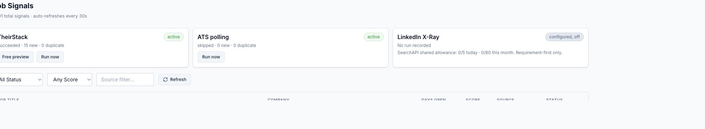
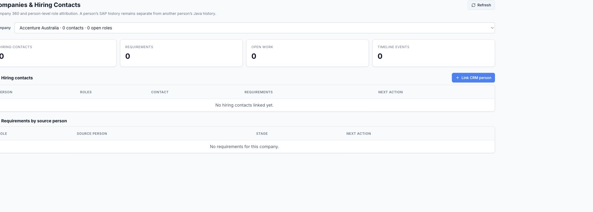
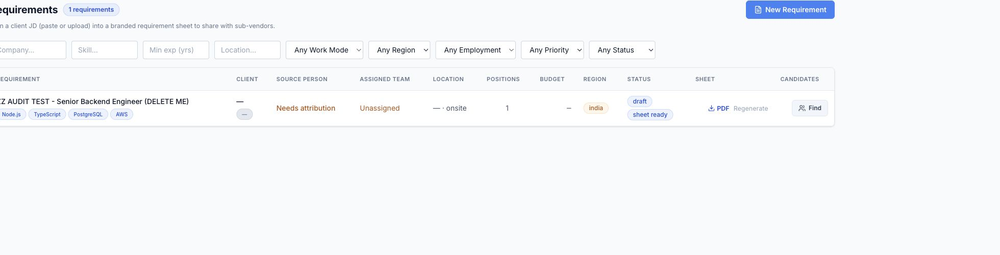
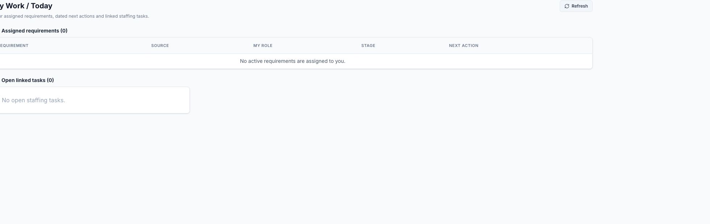
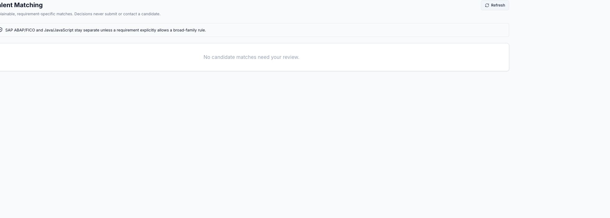
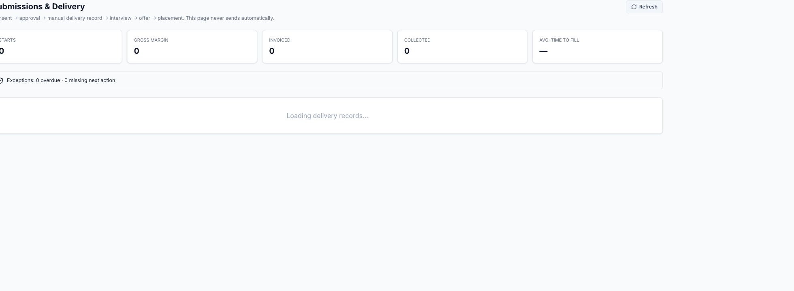
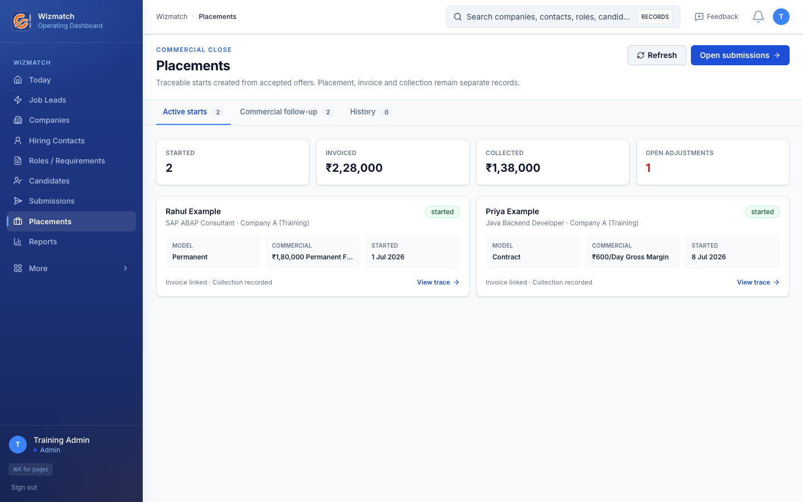
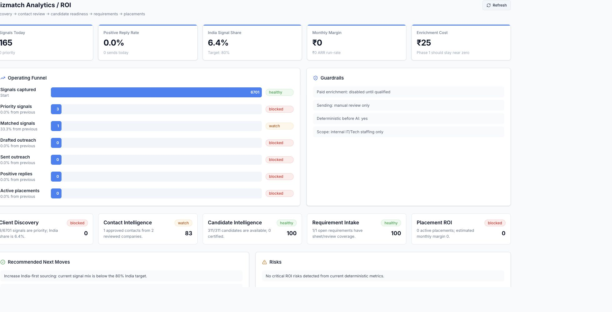
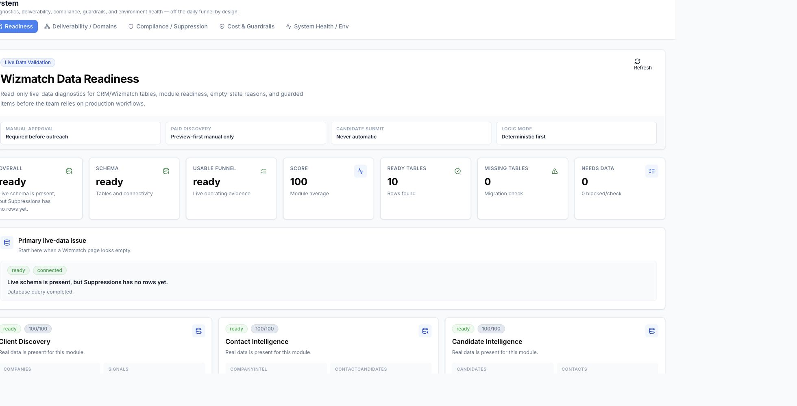

# Wizmatch Staffing OS - Team Standard Operating Procedure

**Version:** 1.0  
**Audience:** Jatin, Kanishk, recruiters, delivery leads, and finance operators  
**Production URL:** `https://crm.growthescalators.com/wizmatch/dashboard`  
**Current pilot access:** Jatin and Kanishk only

## 1. Purpose

Use this SOP to operate the complete staffing workflow without a parallel spreadsheet:

```text
Job signal -> company -> verified hiring POC -> accepted requirement
-> reviewed candidate evidence -> match -> shortlist -> consent/RTR
-> submission -> interview -> offer -> placement -> invoice -> collection
```

The operating rule is simple: **record the truth, keep the next action dated, and never move a
candidate or requirement forward without the evidence required for that stage.**

## 2. What the system does and does not do

### The system does

- Import public demand signals from TheirStack.
- Poll approved Greenhouse, Lever, and Ashby boards after a company board is configured.
- Help identify public Talent Acquisition, recruiter, HR, hiring, delivery, and procurement POCs.
- Keep Person A's SAP requirement separate from Person B's Java requirement.
- Match reviewed candidate skills to reviewed requirement skills.
- Track consent, submissions, interviews, offers, placements, invoices, collections, and margin.
- Preserve an append-only activity trail.

### The system does not

- Treat an imported job as a confirmed client requirement.
- Guess a POC's email address or phone number.
- Automatically accept requirements, shortlist candidates, obtain consent, or submit candidates.
- Automatically send outreach or candidate profiles.
- Treat an unreviewed legacy candidate as match-ready.
- Treat a placement, invoice, and collection as the same event.

## 3. Start of day: Dashboard

Open **Wizmatch -> Dashboard**. Use the summary cards to understand supply, demand, open work, and
placements. The work-order cards show the intended sequence through the platform.



Before beginning:

1. Confirm the page loads without an Error or Retry banner.
2. Note open tasks and priority signals.
3. Do not rely on the total candidate count as verified supply. Candidates become usable only after
   their evidence is reviewed.
4. Open **My Work** for the actions assigned to you.

## 4. Step 1 - Review demand signals

Open **Wizmatch -> Signals**.



### Provider meanings

| Provider | Current use | Operator action |
|---|---|---|
| TheirStack | India-first SAP/Java demand discovery | Review imported signals and qualify only relevant demand. |
| ATS polling | Approved Greenhouse, Lever, and Ashby company boards | Configure the board on the company record first. |
| LinkedIn X-Ray | Requirement-first public candidate lead discovery | Use only after a genuine requirement is accepted and skill-reviewed. |

### Review every signal

For each signal, check:

- Is the job title relevant to SAP ABAP, SAP FICO, Java backend, or JavaScript/frontend?
- Does the description contain genuine role evidence?
- Is the location and work mode workable?
- Is the company in the target geography and account profile?
- Is the signal recent enough to pursue?
- Is it already represented by another signal or requirement?

Choose one outcome:

- **Qualify:** useful demand worth researching.
- **Reject:** irrelevant, stale, duplicate, non-technical, or commercially unsuitable.
- **Leave for review:** evidence is currently insufficient.

Do not promote every job. A signal proves that a company appears to be hiring; it does not prove
that the company has authorized Wizmatch to work the role.

## 5. Step 2 - Find and verify the main POC

For a qualified signal, use **Find POC** or open **Companies & Contacts**.



Research in this order:

1. Existing CRM contacts and company relationships.
2. Existing approved hiring contacts.
3. Company team, leadership, careers, contact, or vendor pages.
4. Public SearchAPI results.
5. Manual research when public evidence is insufficient.

Capture these POC categories separately:

- Primary Talent Acquisition/recruiter.
- Hiring or delivery manager.
- Vendor/procurement contact.
- Backup HR/coordinator.

For each person record:

- Name and current title.
- Company and POC category.
- Public profile/source URL.
- Genuine email, phone, or published contact channel when available.
- Verification state and last-verified date.
- Related signal/requirement.
- Owner, dated next action, and contact history.

### POC state definitions

| State | Meaning | Next action |
|---|---|---|
| `verified` | Named person and genuine channel verified | Coordinate and record the outcome. |
| `identified_channel_pending` | Named person found; no verified channel | Continue manual research. |
| `generic_contact_only` | Only a careers/HR inbox exists | Use for research, not primary attribution. |
| `pending_research` | Research has not been completed | Assign an owner and date. |
| `human_research_required` | Automated/public research is insufficient | Research manually. |
| `not_found` | No defensible POC evidence found | Record the blocker and reassess the account. |

An email pattern is not evidence. Never construct or guess an email address.

## 6. Step 3 - Coordinate and convert real demand

Record every attempt and outcome:

- Contacted or not contacted.
- Channel used.
- Date and owner.
- Response or result.
- Probability/quality assessment.
- Dated next action.

Promote the signal to a draft requirement only when it represents genuine demand the team intends
to pursue. Repeated promotion should return the existing requirement rather than creating another.

## 7. Step 4 - Create and accept the requirement

Open **Wizmatch -> Requirements** and select **New Requirement**.



The retained `ZZ AUDIT TEST` row visible in the current production screenshot is a historical QA
record. Do not work it as a real requirement.

Complete:

- Company.
- Named source POC.
- Genuine source-contact channel.
- Role title and complete job description.
- Location, work mode, employment type, and positions.
- Original budget/rate, currency, and period when known.
- Account owner and recruiter.
- SLA and dated next action.
- Mandatory and preferred canonical skills.
- Minimum experience and other hard blockers.

### Acceptance gate

Do not accept a requirement until all of the following are present:

- Correct company.
- Named source person.
- Genuine contact channel.
- Owner and recruiter.
- SLA.
- Dated next action.
- Reviewed mandatory skills.

Unknown facts should remain unknown. Do not infer historical contacts, ownership, compensation, or
candidate skills.

## 8. Step 5 - Work from My Work

Open **Wizmatch -> My Work**.



Use this as the daily action queue. Every active requirement should have:

- A responsible owner.
- A recruiter.
- A current stage.
- A dated next action.
- No unexplained SLA breach.

If the screen is empty, there is no active requirement assigned to the logged-in user. Do not use a
spreadsheet as a workaround; correct the assignment or requirement readiness in Wizmatch.

## 9. Step 6 - Review candidate evidence and matching

Candidate leads from X-Ray or manual intake are not verified candidates. Before matching, review:

- Canonical specialization.
- Mandatory and preferred skills.
- Experience and skill recency.
- Evidence source.
- Location and work mode.
- Work authorization where relevant.
- Availability.
- Compensation expectations.

Open **Wizmatch -> Talent Matching**.



Review match dimensions in order:

1. Hard blockers.
2. Mandatory canonical skills.
3. Preferred skills.
4. Experience, recency, and evidence.
5. Location, work mode, and authorization.
6. Availability.
7. Commercial feasibility.
8. Explainable score.
9. Human decision.

Use **Shortlist**, **Watch**, or **Reject**. Record a short decision reason. SAP ABAP, SAP FICO,
Java, and JavaScript must remain separate unless the requirement explicitly permits a displayed
broad-family rule.

A shortlist does not create consent or a submission.

## 10. Step 7 - Consent and submission

For each shortlisted candidate:

1. Obtain consent/RTR for the exact requirement.
2. Confirm the consent is current, not revoked, and within its validity period.
3. Prepare the submission draft.
4. Review the named client recipient and evidence.
5. Have the authorized lead/admin approve the submission.
6. Record the manual send only after it actually occurred.

Open **Wizmatch -> Submissions & Delivery**.



The system must reject:

- Submission without exact-requirement consent.
- A duplicate active submission for the same candidate and requirement.
- A placement that is not traceable to the exact submission.

## 11. Step 8 - Interview, offer, and placement

Update delivery as the outcome happens:

- Interview round, participants, date, and feedback.
- Offer version, amount/rate, currency, period, and status.
- Joining/start date.
- Placement type: permanent or contract.
- Replacement/refund terms or contract margin inputs.

Open **Wizmatch -> Placements**.



For permanent staffing, record the agreed fee, replacement period, and refund exposure. For
contract staffing, record bill rate, loaded cost, currency, and period. A sub-20% target margin
exception needs an explicit admin record.

Never treat these as interchangeable:

```text
Placement/start != invoice issued != payment collected
```

## 12. Step 9 - Management reporting

Open **Wizmatch -> Analytics**.



Review:

- Signals and qualified demand.
- POC completion.
- Accepted requirements.
- Qualified candidates per requirement.
- Submission-to-interview conversion.
- Interview-to-offer conversion.
- Offer-to-start conversion.
- Time to shortlist and time to fill.
- Placement value, invoicing, collection, and gross margin.

Do not interpret an empty funnel as a software failure when no genuine operating records have yet
been entered. Use **System** to distinguish an empty funnel from a technical problem.

## 13. Step 10 - System and readiness checks

Open **Wizmatch -> System**.



Use this page when a module looks empty or unavailable. Confirm:

- Overall, schema, and usable funnel status.
- Missing/needs-data counts.
- Provider configuration and source health.
- Cost and guardrail status.
- Safe automation state.
- Sending remains disabled unless a separately approved sending launch occurs.

If a page shows an error, use **Retry**. Do not assume that a blank page means there are no records
until System confirms the data and schema state.

## 14. Configure ATS monitoring

For every approved company using Greenhouse, Lever, or Ashby:

1. Open the company in **Companies & Contacts**.
2. Confirm the ATS provider.
3. Enter and verify the ATS slug and public board URL.
4. Mark the configuration approved.
5. Preview the board.
6. Let the daily polling run or use a controlled manual run.

Start with 5-10 priority companies. A broken board must not block polling for other companies.
Closed jobs remain historical and are marked stale rather than deleted.

## 15. Enable and use LinkedIn X-Ray

X-Ray should be enabled only after the first genuine requirement is:

- Accepted.
- Attributed to a verified POC.
- Assigned to an owner and recruiter.
- Skill-reviewed.
- Equipped with a dated next action.

Then:

1. Open the requirement.
2. Review mandatory/preferred skills, location, experience, and work mode.
3. Run one requirement-specific X-Ray search.
4. Review every public lead.
5. Add only verified evidence to the candidate profile.
6. Recalculate matching.

X-Ray stores public search-result evidence only. It does not log into LinkedIn, scrape private
profiles, or message candidates.

## 16. Daily operating rhythm

### Morning

- Open My Work and overdue actions.
- Review new TheirStack and ATS signals.
- Qualify/reject demand.
- Assign POC research.

### Midday

- Verify hiring POCs and channels.
- Record manual coordination.
- Convert genuine demand into requirements.
- Complete skills, ownership, SLA, and next actions.

### Afternoon

- Review candidate evidence.
- Evaluate matches.
- Shortlist/watch/reject.
- Obtain consent and prepare submissions.
- Update interviews and feedback.

### End of day

- Ensure every active requirement has a dated next action.
- Close stale work with an explicit reason.
- Review delivery exceptions.
- Reconcile placements, invoices, collections, and margin.

## 17. Definition of done by stage

| Stage | Done when |
|---|---|
| Signal review | Relevance decision and reason recorded. |
| POC research | State, owner, evidence, and next action recorded. |
| Requirement acceptance | Company, named POC/channel, owner, recruiter, SLA, next action, and reviewed skills complete. |
| Candidate review | Evidence, recency, availability, and commercial facts reviewed. |
| Shortlist | Human decision and reason saved; no automatic consent/submission. |
| Consent | Exact requirement, validity, document/evidence, and revocation state recorded. |
| Submission | Approved, named recipient, delivery evidence, and history recorded. |
| Interview/offer | Each round/version linked to the exact submission. |
| Placement | Traceable start and economics recorded. |
| Commercial close | Invoice and collection separately reconciled. |

## 18. Pilot quality targets

- Review the first 25 TheirStack signals and target at least 80% relevance among qualified signals.
- Give 100% of qualified signals a POC state, owner, and next action.
- Identify a named POC within 24 hours where public evidence exists.
- Record a genuine contact channel or explicit research blocker within 48 hours.
- Retain source-signal and POC traceability for every accepted requirement.
- Identify at least four qualified candidates for each workable requirement where supply exists.
- Produce zero automatic submissions and zero duplicate provider signals after reruns.

## 19. Escalation rules

- **P0/P1:** Wrong-tenant data, submission without consent, duplicate placement, public private
  document, or production 5xx affecting core workflows. Stop the affected workflow immediately.
- **P2:** A workflow is blocked or materially misleading. Record the route, role, steps, and error;
  use the tested fix-and-retest process.
- **Data issue:** Correct through explicit attribution, status changes, or superseding records. Do
  not delete historical staffing events.

## 20. Quick operator checklist

Before finishing any requirement, answer yes to all:

- Is the company correct?
- Is the actual source POC named?
- Is the contact channel genuine and verified?
- Is ownership clear?
- Is the next action dated?
- Are mandatory skills canonical and reviewed?
- Are candidate facts evidence-backed?
- Is consent exact to the requirement?
- Is the submission approved and traceable?
- Are placement, invoice, and collection separate?

